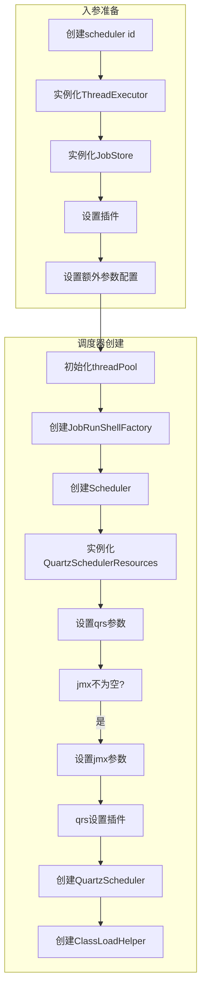

## DirectSchedulerFactory 

DirectSchedulerFactory 创建调度器流程


```mermaid
flowchart 
    5 --> C1
    subgraph 入参准备 
        direction LR
        1[创建scheduler id] --> 2[创建ThreadPool]
        2[实例化ThreadExecutor] -->3[实例化JobStore]
        3[实例化JobStore] --> 4[设置插件]
        4[设置插件] --> 5[设置额外参数配置]
    end
    subgraph 调度器创建
        C1[初始化threadPool] --> C2[创建JobRunShellFactory]
        C2[创建JobRunShellFactory] --> C3[创建Scheduler]
        C3[创建Scheduler] --> C4[实例化QuartzSchedulerResources]
        C4[实例化QuartzSchedulerResources] --> C5[设置qrs参数]
        C5[设置qrs参数] --> C6{jmx不为空?}
        C6[jmx不为空?] -->|是| C7[设置jmx参数]
        C7 -->C8[qrs设置插件]
        C8 --> C9[创建QuartzScheduler]
        C9 --> C10[创建ClassLoadHelper]
        
    end

```
```mermaid

```
